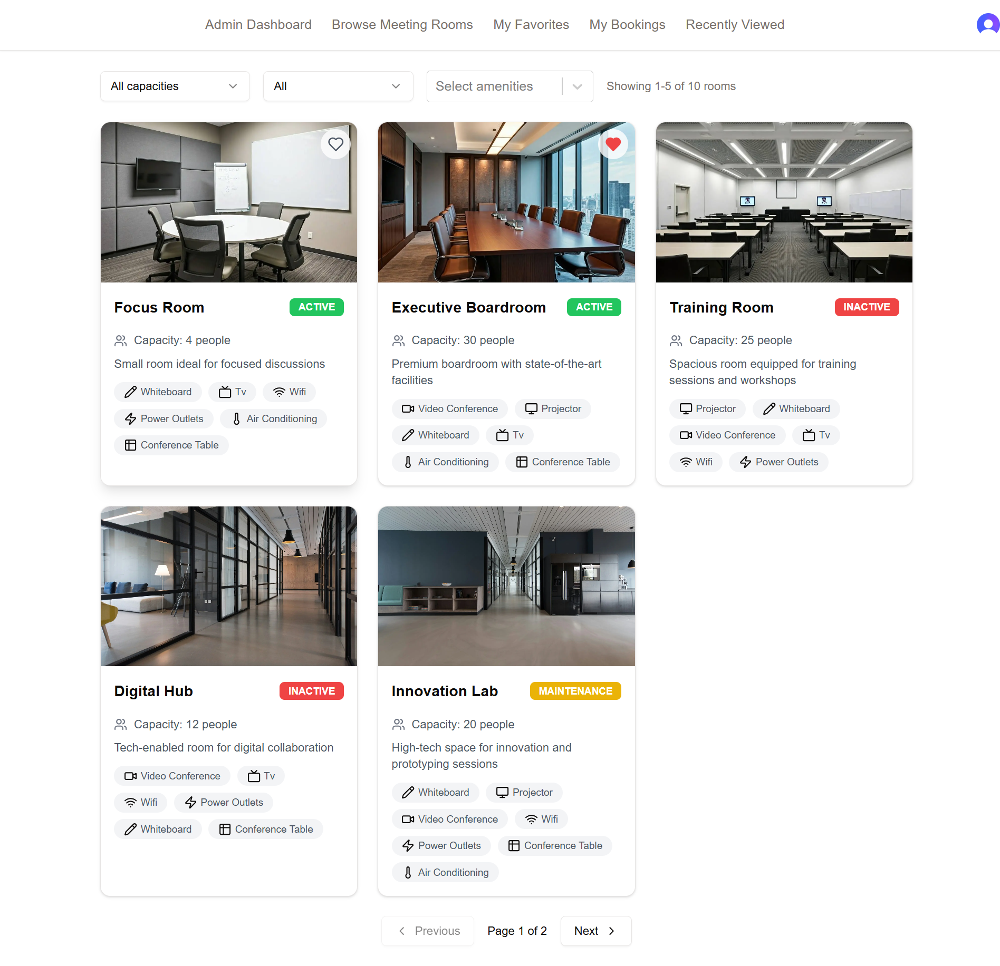
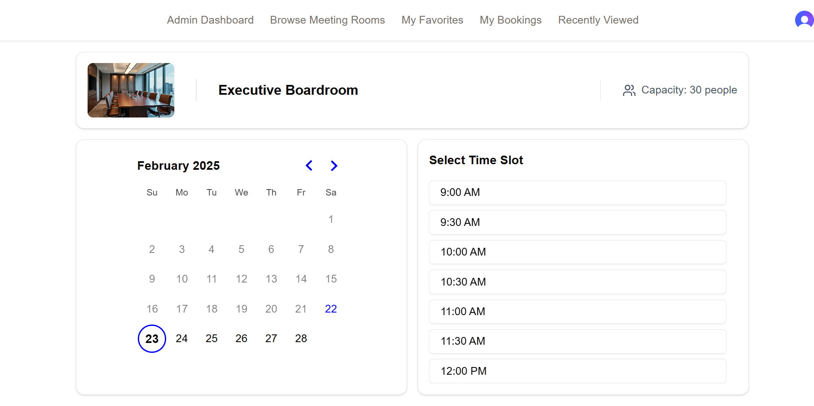
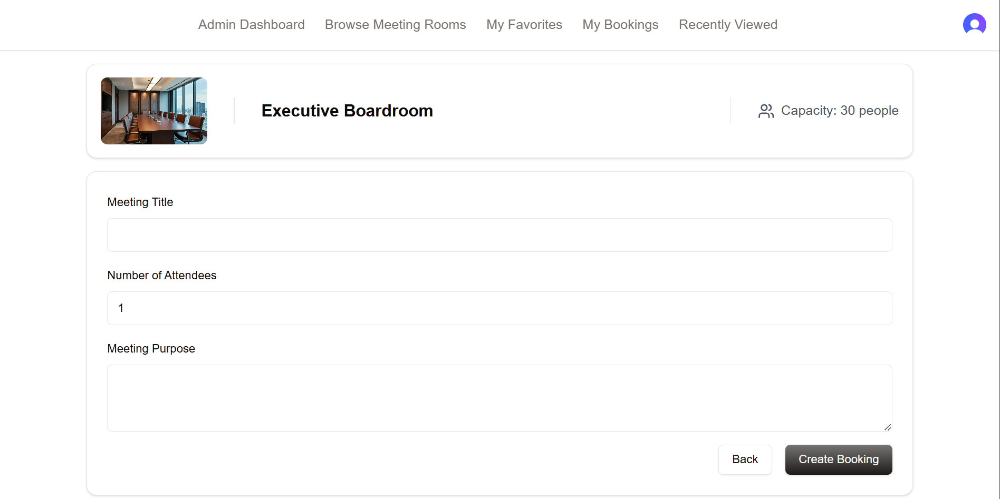
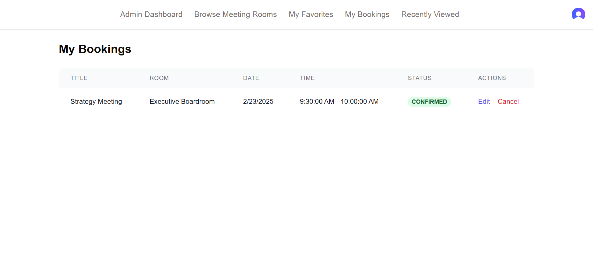
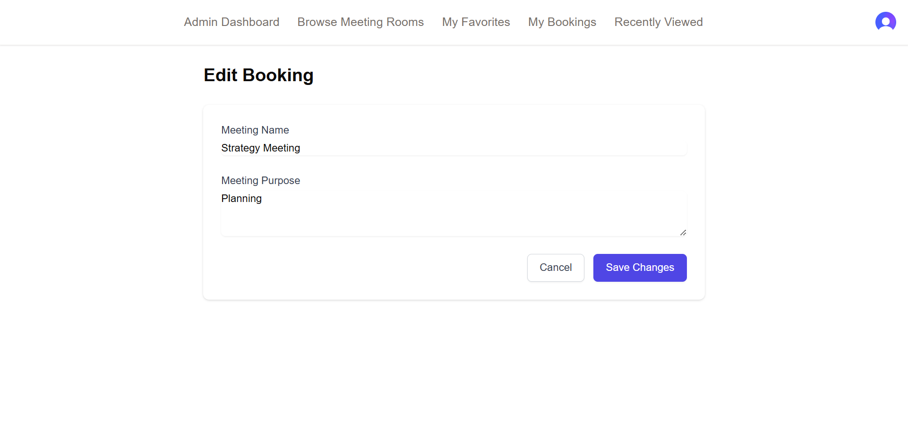
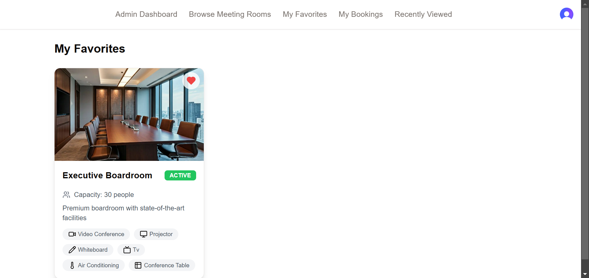
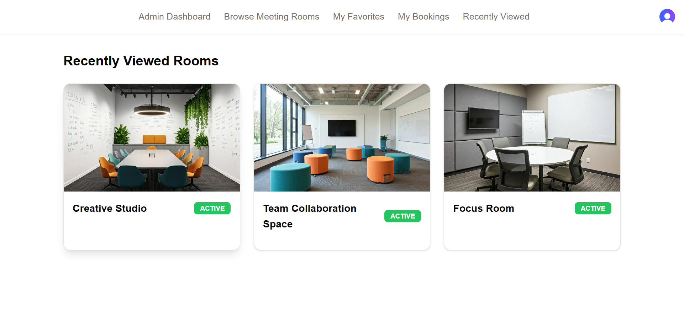
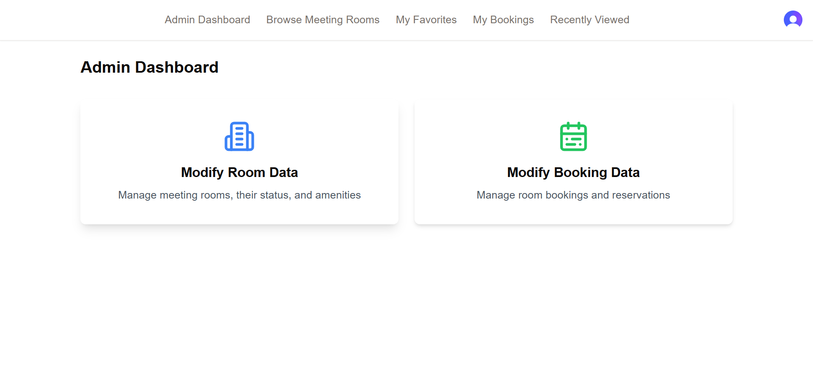
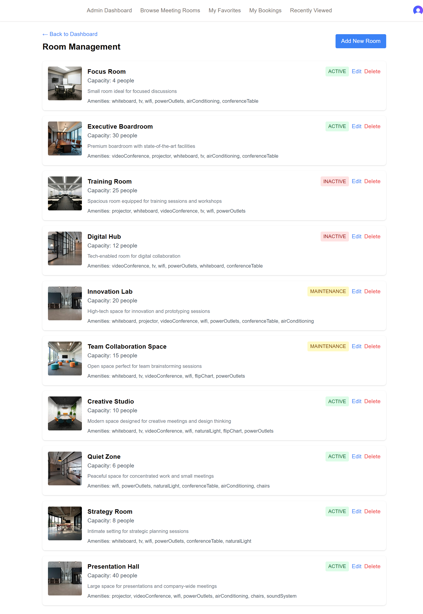
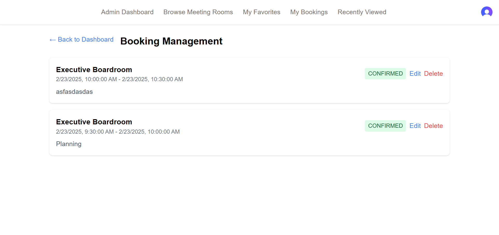

This is a [Next.js](https://nextjs.org) project bootstrapped with [`create-next-app`](https://nextjs.org/docs/app/api-reference/cli/create-next-app).

- To understand my thought process, you can read my initial notes which I wrote before coding [notes](notes/notes.md)

## Getting Started

- Clone the repo first.
```bash
git clone https://github.com/faisalbhuiyan3038/meeting-room-booking-system.git
```
- Install dependencies
```bash
npm install
```
- Follow `.env.example` and create a .env file with variables. (This is needed for seed data and app to work!)
- After environment variables are set up, run first migration.
```bash
npx prisma migrate dev --name init
```
- Generate prisma client.
```bash
npx prisma generate
```
- Push database.
```bash
npx prisma db push
```
- Migrate seed data to create rooms, bookings, favorites and users if you don't want to start from scratch.
```bash
npx prisma db seed
```
- Run the development server.
```bash
npm run dev
```

## Important Notes
- The seed data creates 10 rooms, 1 booking, 1 favorite and 2 users.
- The Admin user has admin role in seed data with email `admin@admin.com` and password `Password123`.
- The Regular user has regular role in seed data with email `user@user.com` and password `Password123`.
- I disabled compromised password and strength detection since for testing purposes, I wanted to use weak passwords.
- Login and enjoy!


## Features Implemented
- Authentication/Sign-in/Sign-up with Clerk. Admin user is already created for the app in clerk.
- Beautiful Loading Component when app is fetching data.
- Beautiful and informative Meeting Room List Page showing capacity, amenities and status.
- Filter Meeting Room List by Capacity, Room Status and one or more amenities.
- Ability to favorite/unfavorite Meeting rooms by clicking on heart icon after hovering on image.
- Ability to see all Favorited Rooms in one page.
- Ability to see recently viewed rooms in one page.
- Ability to choose day from calendar view and time slot for Booking
- Checks to ensure selected slot is free/unoccupied.
- Perform CRUD operations on Rooms and Bookings.
- Upload image for new rooms to Cloudinary.
- Ability to edit/cancel current user's booking.
- Prevent double booking by immediately checking if selected slot is free/unoccupied.
- Show messages in console for seed data operations for visual feedback.

## Technical Jargons
- Used Next.js 14 with App Router instead of the latest Next.js 15.
- Used AivenDB free tier for database with Prisma as ORM.
- Used Clerk for managing users.
- Used React Query for data fetching and caching.
- Used Cloudinary for image storage.
- Saved recently viewed rooms in local storage.
- Save favourite rooms in Database.
- Used TailwindCSS for styling.
- Used Zod for form validation.
- Used Shadcn UI for components.
- Used lucide icons for icons.

## Screenshots/Demo

### Room List and Filtering


### Room Booking Process



### User Features





### Admin Dashboard and Management



